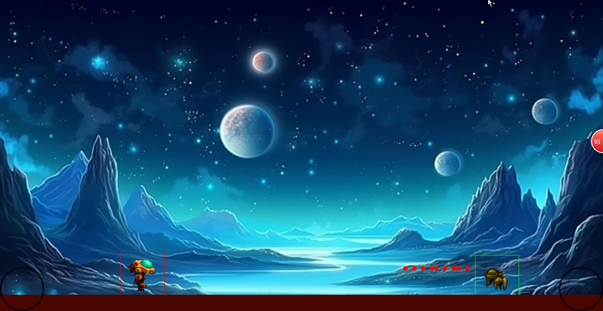

# Space Runner - Compose Multiplatform Game Engine


Welcome to **Space Runner**, a fast-paced, action-packed game where you control a robot character
who must jump over and shoot approaching bugs to survive! Built using the **Compose Multiplatform**
framework, this game engine is designed to be cross-platform, allowing you to run the game on
Android, iOS, Desktop, and Web with a single codebase.

## Features

- **Cross-Platform Support**: Write once, run anywhere! Space Runner is built with Compose
  Multiplatform, enabling seamless deployment on multiple platforms.
- **Simple Controls**: Intuitive controls for jumping and shooting, making it easy to pick up and
  play.
- **Dynamic Gameplay**: Dodge and shoot approaching bugs to survive as long as possible.
- **Customizable**: Easily extend or modify the game logic, graphics, and mechanics.
- **Lightweight and Efficient**: Optimized for performance across all supported platforms.

## Getting Started

### Prerequisites

To build and run Space Runner, you'll need the following:

- **Kotlin**: The game is written in Kotlin, so ensure you have the latest version installed.
- **Compose Multiplatform**: Familiarity with Jetpack Compose or Compose Multiplatform is
  recommended.
- **Android Studio or IntelliJ IDEA**: For development and debugging.
- **Platform-Specific SDKs**: Depending on the platforms you want to target (e.g., Android SDK,
  Xcode for iOS, etc.).
- **(Have not tested it on xcode for iOS yet).

### Installation

1. **Clone the Repository**:
   ```bash
   git clone https://github.com/Ohior/SpaceRunner.git
   cd space-runner
   ```

2. **Open the Project**:
    - Open the project in Android Studio or IntelliJ IDEA.

### Gameplay

**Although the game is not fully completed yet and is still in production, you can still plat and
enjoy the game**

## Before running!

- check your system with [KDoctor](https://github.com/Kotlin/kdoctor)
- install JDK 17 or higher on your machine
- add `local.properties` file to the project root and set a path to Android SDK there

### Android

- run `./gradlew :composeApp:assembleDebug`

### Desktop

Run the desktop application: `./gradlew :composeApp:run`

### iOS

To run the application on iPhone device/simulator:

- Open `iosApp/iosApp.xcproject` in Xcode and run standard configuration
- Or
  use [Kotlin Multiplatform Mobile plugin](https://plugins.jetbrains.com/plugin/14936-kotlin-multiplatform-mobile)
  for Android Studio
  Run iOS simulator UI tests: `./gradlew :composeApp:iosSimulatorArm64Test`

### Wasm Browser (Alpha)

Run the browser application: `./gradlew :composeApp:wasmJsBrowserDevelopmentRun --continue`

## Contributing

We welcome contributions to Space Runner! If you'd like to contribute, please follow these steps:

1. Fork the repository.
2. Create a new branch for your feature or bugfix.
3. Make your changes and ensure the code builds and runs on all target platforms.
4. Submit a pull request with a detailed description of your changes.

## License

Space Runner is licensed under the **MIT License**.

## Acknowledgments

- **JetBrains**: For creating Kotlin and Compose Multiplatform.
- **Compose Multiplatform Community**: For their support and contributions to the framework.
- **You**: For playing and contributing to Space Runner!

## Support

If you encounter any issues or have questions, please open an issue.

---
Enjoy playing **Space Runner**! May your robot survive the bug invasion and achieve the highest
score! 🚀
